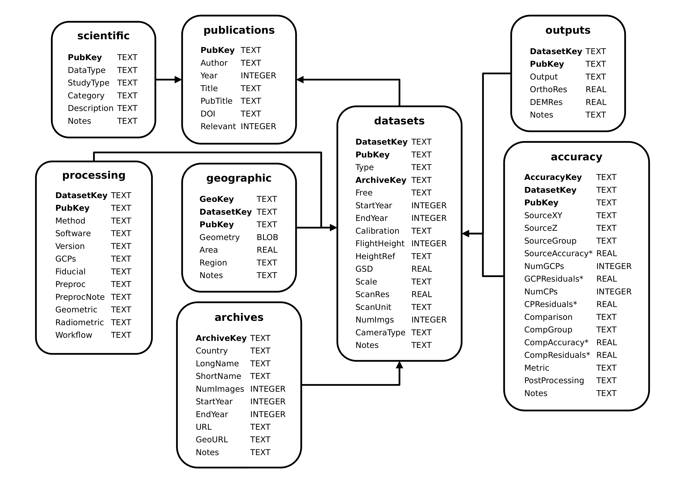

# Unlocking the Past: A Review of Historical Aerial and Satellite Stereo-Imagery for Geoscience Applications

## abstract

Dramatic changes have occurred over the past century in many parts of the planet due to natural factors and intensifying
human activities. Understanding these changes is critical for quantifying long-term environmental trends and modelling
future conditions. A vast, underexploited resource for such analysis lies in historical aerial and satellite stereo
imagery captured with analogue cameras from the early 1900s to the early 2000s. Originally acquired for military and
mapping purposes, the stereoscopic nature of historical images offers a unique potential to reconstruct 3D Earth surface
changes across the 20th century. Recent advances in photogrammetry and computer vision have greatly enhanced this
potential.

Despite the early recognition of their value, these datasets remain underexploited due to challenges related to:
  1) fragmented and inaccessible archives,
  2) digitisation and associated costs, and
  3) a lack of scalable, automated processing solutions.

This review addresses these challenges by analysing 198 studies that digitally process historical aerial and satellite
stereo imagery for orthoimage and DEM generation. We provide an overview of accessed archives, processing strategies, 
and software pipelines. We discuss emerging tools and advanced image-matching algorithms that are improving automation
and georeferencing and highlight how historical imagery can support a wide range of geoscientific applications, from
climate change to urban development. Finally, we emphasise the urgent need to unlock these archives and develop
efficient, reproducible workflows to preserve and exploit this irreplaceable remote sensing dataset before physical
degradation or institutional neglect makes it inaccessible.

## interactive map

Below is an interactive map showing the different study areas for the reviewed studies:

<iframe src="data/interactive_map.html" height="600px" width="100%"></iframe>

## the dataset

This repository contains the database created as part of the review, in both SQLite and Excel Workbook formats:

- [SQLite Database](data/Historic_Air_Photos.db)
- [Excel Workbook](data/Review_Historic_Air_Photos.xlsx)

The database has the following structure:

*Database tables, data types, and links. Bold text indicates a key. For a complete description of each table and
field in the database, see Table A1.*

Each table contains the following information:

- **publications** - citation information about the studies reviewed, including author, year, title, publication
  and DOI (if available)  
- **scientific** - general information about the studies reviewed, including the type of data used, focus of the study,
  and general category (e.g., geomorphology, glaciology, etc.)
- **geographic** - geographic information about the study areas, including bounding geometry and area (if given)
- **datasets** - the datasets used in each study, including the type of photograph, archive location,
  acquisition information, and scanning information
- **processing** - how the datasets were processed, including the software used, whether GCPs or
  fiducial markers were used, and information about any pre-processing steps
- **accuracy** - the reported accuracy of the processed datasets/outputs, including comparison to reference data or GCPs
- **outputs** - the processed outputs of each dataset, including what outputs were produced and DEM/Orthophoto resolution
- **archives** - the archives that provided the images used in each study, including the name and URL (if available)

Scripts for generating the figures and tables are contained in the `scripts/` folder (`scripts/Fig*.py`), and the individual 
figures and data files are found in the `figures/` folder. To run the scripts, use the provided `environment.yml` file 
to create a conda environment with the necessary python packages.

The (non-figure) scripts in the folder are:

- `tools.py` - contains helper functions used by many of the other scripts, including for loading the data files
- `create_sqlite.py` - converts the .xlsx data files into a SQLite database
- `make_folium_map.py` - creates the interactive map shown in the frame above (or at `data/interactive_map.html`)
- `check_accuracy_reporting.py` - prints a number of statistics about the percentage of studies/datasets that have
  various accuracy measures/metrics
